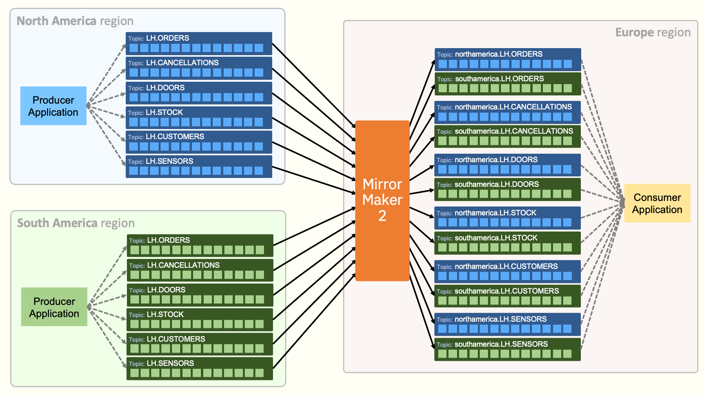
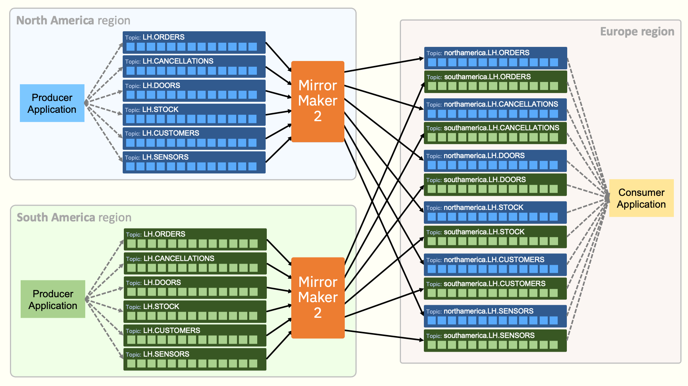
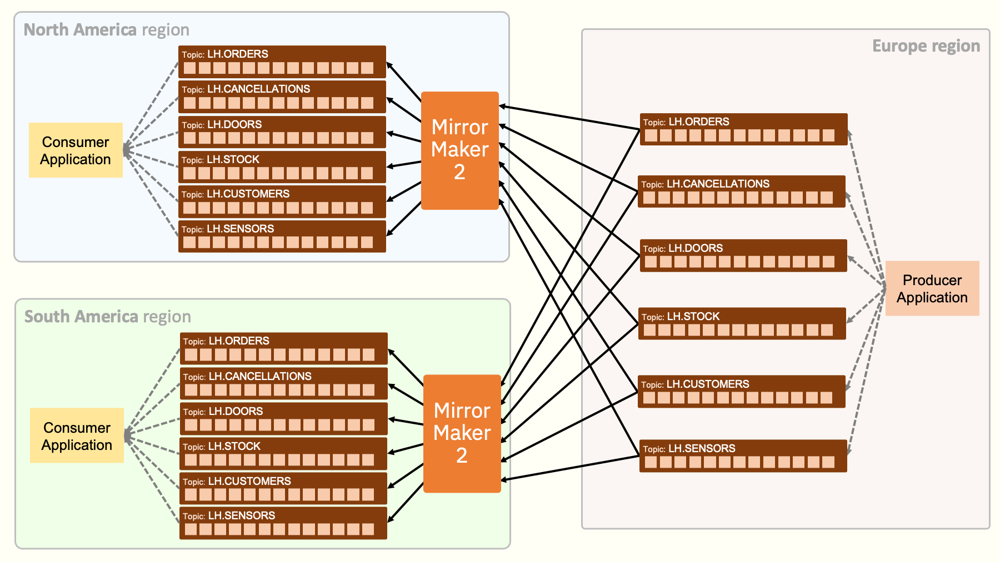
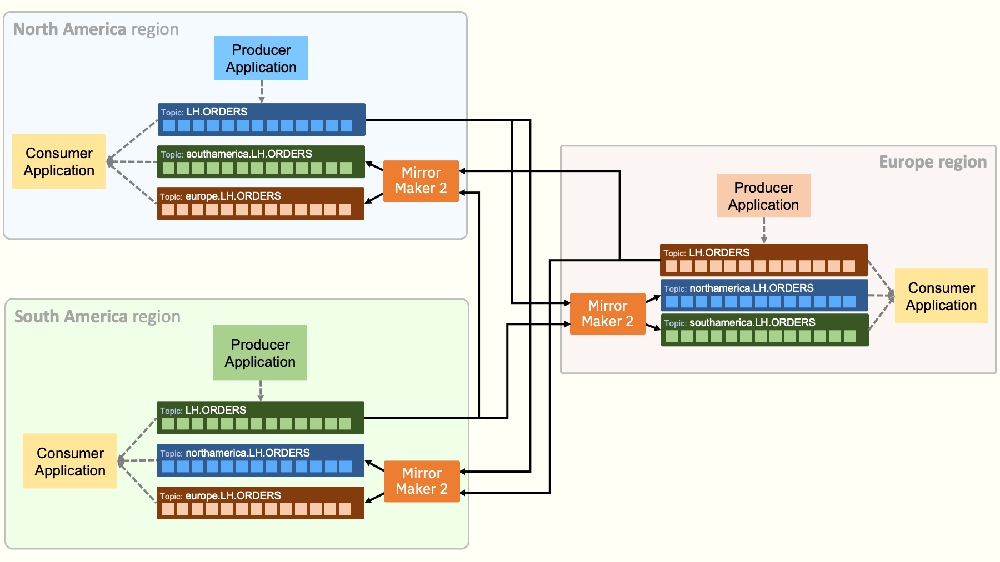
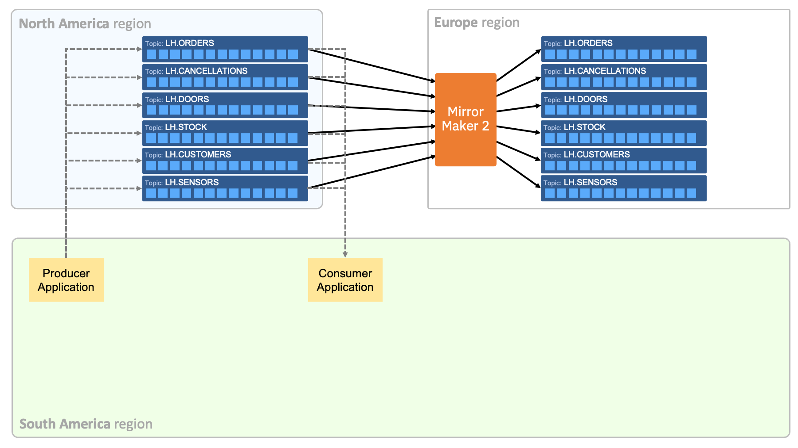
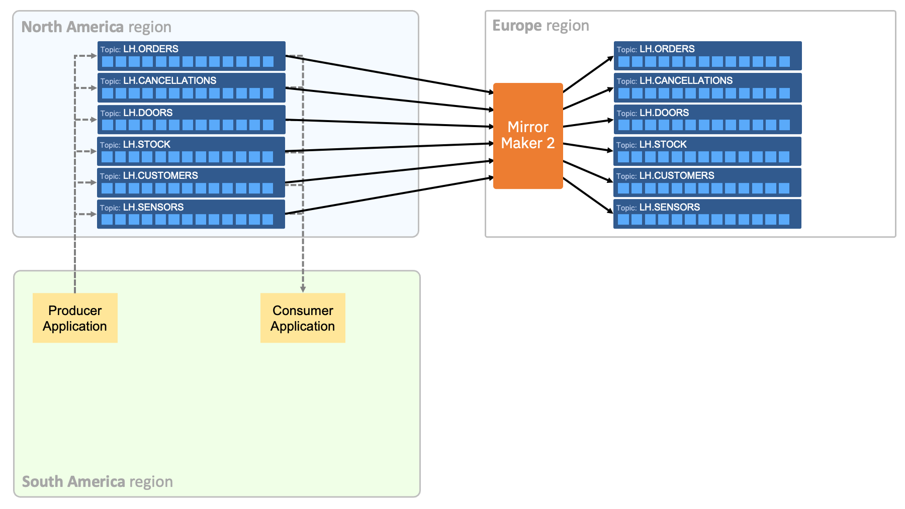

# Demos of Mirror Maker 2 with IBM Event Streams

Mirror Maker 2 is a powerful and flexible tool for moving Kafka events between Kafka clusters. These demos aim to inspire you to think about different ways that you could use it in your own projects.

A great way to learn how to use it is to play with it for yourself, so this repo includes Ansible playbooks that create examples of a variety of different Mirror Maker topologies.

These demonstrations all run in a single OpenShift cluster, using separate namespaces to represent "regions".

To see the requirements for creating these demos, see [REQUIREMENTS.md](./REQUIREMENTS.md).

A more detailed description of what these demos illustrate can be found in the blog posts starting from https://dalelane.co.uk/blog/?p=5098

## Using Mirror Maker 2 to aggregate events from multiple regions

Ansible playbook: [`01-aggregate-central/setup.yaml`](./01-aggregate-central/setup.yaml)

Example of how to run the playbook: [`setup-01-aggregate-central.sh`](./setup-01-aggregate-central.sh)

To see the events received by the consumer application running in the "Europe region", you can run the [`consumer-europe.sh`](./consumer-europe.sh) script.

#### An alternative topology:

Ansible playbook: [`02-aggregate-distributed/setup.yaml`](./02-aggregate-distributed/setup.yaml)

Example of how to run the playbook: [`setup-02-aggregate-distributed.sh`](./setup-02-aggregate-distributed.sh)

## Using Mirror Maker 2 to broadcast events to multiple regions

Ansible playbook: [`03-broadcast/setup.yaml`](./03-broadcast/setup.yaml)

Example of how to run the playbook: [`setup-03-broadcast.sh`](./setup-03-broadcast.sh)

To see the events received by the consumer applications, you can run the [`consumer-northamerica.sh`](./consumer-northamerica.sh) and [`consumer-southamerica.sh`](./consumer-southamerica.sh) scripts.

## Using Mirror Maker 2 to distribute topics across multiple regions

Ansible playbook: [`04-shared-aggregate/setup.yaml`](./04-shared-aggregate/setup.yaml)

Example of how to run the playbook: [`setup-04-shared-aggregate.sh`](./setup-04-shared-aggregate.sh)

To see the events received by the consumer applications, you can run the consumer scripts:
- [`consumer-northamerica.sh`](./consumer-northamerica.sh)
- [`consumer-southamerica.sh`](./consumer-southamerica.sh)
- [`consumer-europe.sh`](./consumer-europe.sh)

## Using Mirror Maker 2 to create a failover cluster

Ansible playbooks:
- [`05-shared-aggregate/setup.yaml`](./05-active-passive/setup.yaml)
- [`05-shared-aggregate/failover.yaml`](./05-active-passive/failover.yaml)

Example of how to run the playbooks:
- [`setup-05-active-passive.sh`](./setup-05-active-passive.sh)
- [`setup-05-failover-to-passive.sh`](./setup-05-failover-to-passive.sh)

## Using Mirror Maker 2 to restore events from a backup cluster

Ansible playbooks:
- [`06-backup-restore/initial-setup.yaml`](./06-backup-restore/initial-setup.yaml)
- [`06-backup-restore/recreate-from-backup.yaml`](./06-backup-restore/recreate-from-backup.yaml)
- [`06-backup-restore/resume-applications.yaml`](./06-backup-restore/resume-applications.yaml)
- [`06-backup-restore/setup-new-backup.yaml`](./06-backup-restore/setup-new-backup.yaml)

Example of how to run the playbooks:
- [`setup-06-backup.sh`](./setup-06-backup.sh)
- [`setup-06-restore.sh`](./setup-06-restore.sh)
- [`setup-06-resume.sh`](./setup-06-resume.sh)
- [`setup-06-setup-new-backup.sh`](./setup-06-setup-new-backup.sh)
